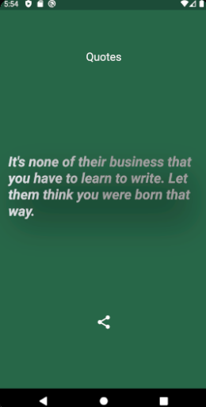

# quotes

Quotes Api uses api to fetch quotes made using deno as backend server and it shows quotes with author name
First you need to install deno and run server
use 'deno run --allow-net index.ts' to run server files are inside server folder

